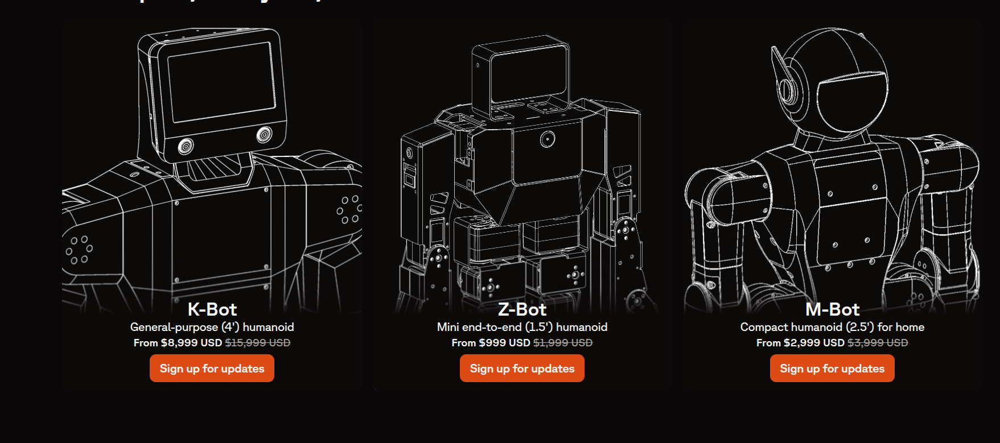
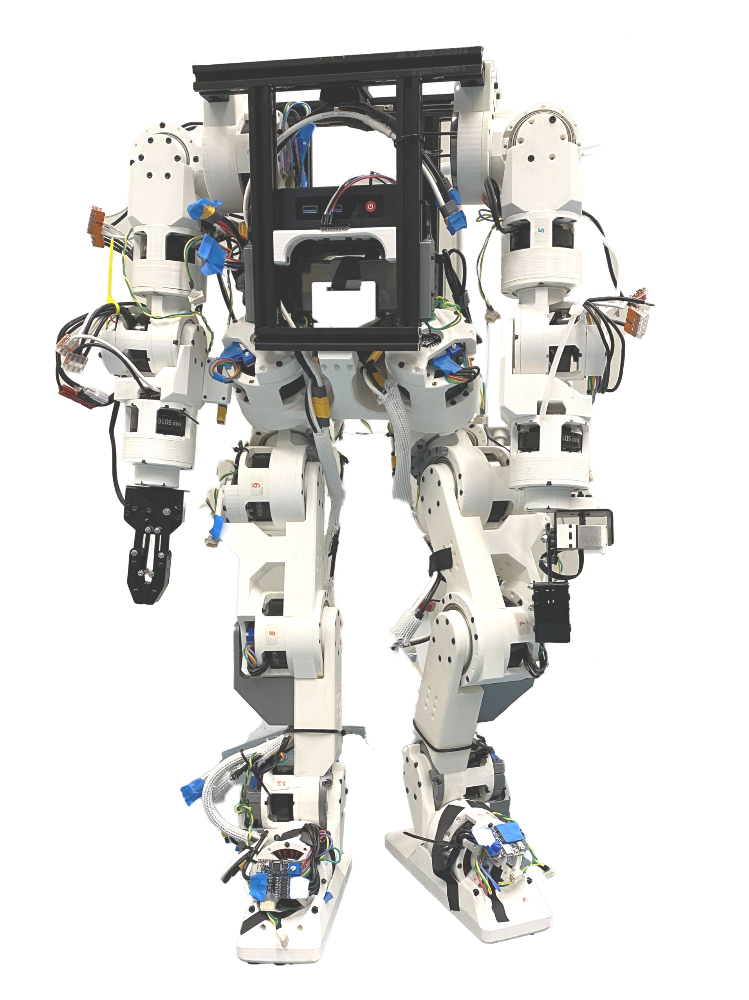
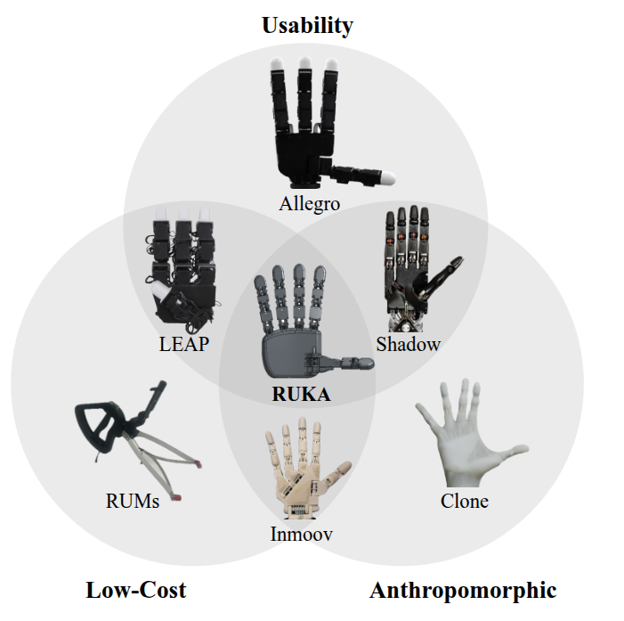
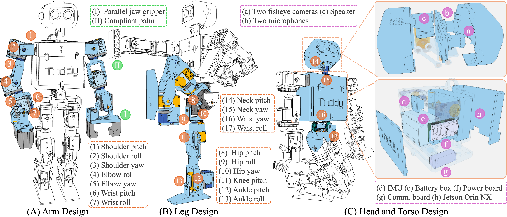
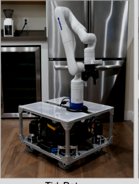
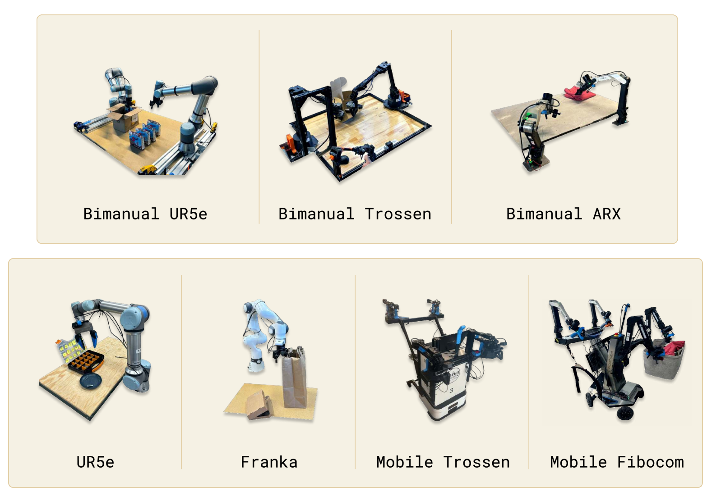
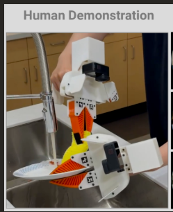
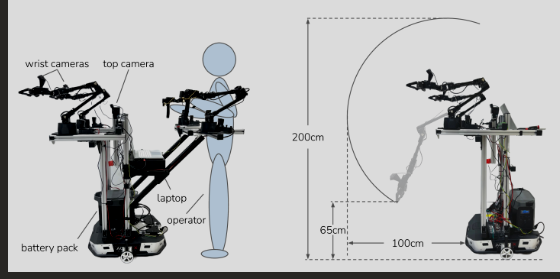

# Robotics-Platforms

A curated list of robotics platforms.

## Industry 

| Company | Comments |
|-------|-------|
| [Dyna Robotics](https://www.dyna.co/) |  arm for $2.5k by [AgileX Robotics](https://global.agilex.ai/pages/about-us) | . $6.5k cost |  |
| [Allegro Hand](https://www.allegrohand.com/?gad_source=1&gad_campaignid=21343116219&gbraid=0AAAAA9UNdCx_a9ovFh8C1jpO0fg2CgIxe&gclid=CjwKCAjwtrXFBhBiEiwAEKen1yZzFNLVnxucm3Pu7FraqHEa33LmQwF7H-VHnctP5Q5-Asm_xQv0IBoChKgQAvD_BwE). Cost supposedly over $16k according to LEAP Hand paper |  |
| [Ufactory Arm](https://www.ufactory.us/?utm_source=google&utm_medium=cpc&utm_campaign=competitorsaisa&utm_term=ur&gad_source=1&gad_campaignid=22247466162&gbraid=0AAAAApkOHBCXVyg-3N4z2NMVbNN4x8Hpy&gclid=CjwKCAjwk7DFBhBAEiwAeYbJsX-UCjeetiMaLv2gJDxo9XbBT2ssLuWmWGtq4MRxVJvQ-wp1wRRgyxoCbOsQAvD_BwE) |  |  |
| [Reachy2](https://fortune.com/2025/04/14/ai-company-hugging-face-buys-humanoid-robot-company-pollen-robotics-reachy-2/) | $70k humanoid with mobile base by Pollen Robotics. Purchased by Huggingface earlier this year.  |  | : Arms for as cheap as $800. Mobile platforms + arms for as cheap as $1600. | : ca. ~$30k |  | Huggingface hand for less than $250.  |
| [Huggingface HopeJR Arm](https://huggingface.co/docs/lerobot/hope_jr) |  - price starts at ~$9k |  |
| [WidowX](https://www.trossenrobotics.com/widowx-250): Trossen arms  ca. $4-5k depending on version |  |  | Seems like extension of [[Universal Manipulation Interface In-The-Wild Robot Teaching Without In-The-Wild Robots]].  |
| [DexWrist A Robotic Wrist for Constrained and Dynamic Manipulation](https://arxiv.org/html/2507.01008v1) | MIT paper that developed a compliant robotic wrist for advanced manipulation  |
| [Demonstrating Berkeley Humanoid Lite An Open-source, Accessible, and Customizable 3D-printed Humanoid Robot](https://arxiv.org/html/2504.17249v1) | Berkeley Humanoid  |
| [RUKA Rethinking the Design of Humanoid Hands with Learning](https://ruka-hand.github.io/) | Has good overview of existing hands and introduces open-source RUKA hand (ca. $1.3k)  |
| [A low-cost and lightweight 6 DoF bimanual armfor dynamic and contact-rich manipulation](https://arxiv.org/pdf/2502.16908) | $6k bimanual manipulator that is stationary  |
| Categorizing robots by performance fitness into the tree of robots - Nature Machine Intelligence | Categorizes robot arms  |
| [DOGlove Dexterous Manipulation with a Low-Cost Open-Source Haptic Force Feedback Glove](https://arxiv.org/html/2502.07730v1) | Tactile glove that assists haptic force feedback during teleoperation  |
| [ToddlerBot Open-Source ML-Compatible Humanoid Platform for Loco-Manipulation](https://toddlerbot.github.io/) | Stanford Humanoid  |
| TidyBot++ An Open-Source Holonomic Mobile Manipulator for Robot Learning |  |
| [𝜋₀ - A Vision-Language-Action Flow Model for General Robot Control](https://arxiv.org/html/2410.24164v3) | Uses [[FAST Efficient Action Tokenization for Vision-Language-Action Models]].  🔎 |
| [DROID - A Large-Scale In-The-Wild Robot Manipulation Dataset](https://arxiv.org/html/2403.12945v2) | Large dataset collected by 50+ authors, Berkeley, Stanford, UT Austin.  |
| [Universal Manipulation Interface In-The-Wild Robot Teaching Without In-The-Wild Robots](https://arxiv.org/html/2402.10329v3) |  |
| [Mobile ALOHA - Learning Bimanual Mobile Manipulation with Low-Cost Whole-Body Teleoperation](https://arxiv.org/html/2401.02117v1) |  |
| [LEAP Hand Dexterous, Low-cost Hybrid Rigid-Soft Hand for Robot Learning](https://v2-adv.leaphand.com/#) | Leap hand 2.0 was introduced at RSS. Links for hand not working well though. Supposedly there is a cheap hand version for $200-$300. V2 looks like  |

Any pull requests with missing platforms or papers are welcome! Connect with me on [@AlexKoven](https://x.com/AlexKoven) or [@Alexander Nettekoven](https://www.linkedin.com/in/alexander-nettekoven/).

