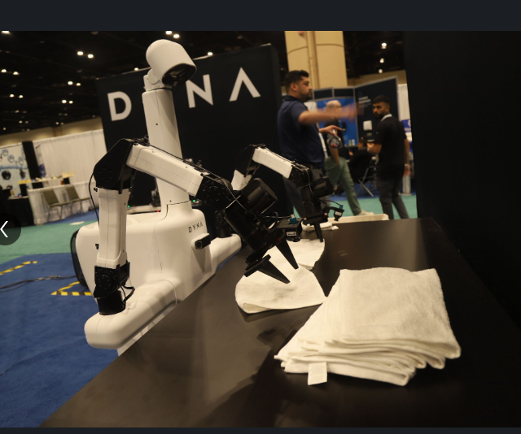
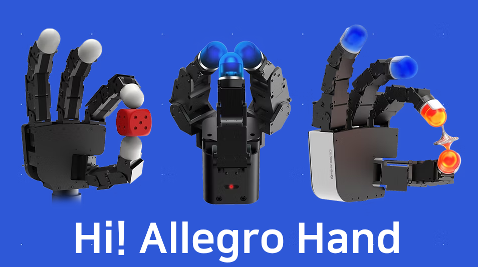
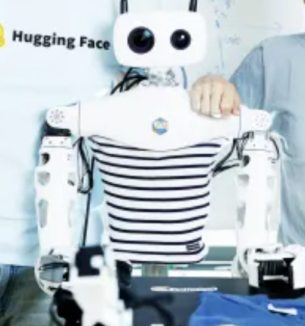
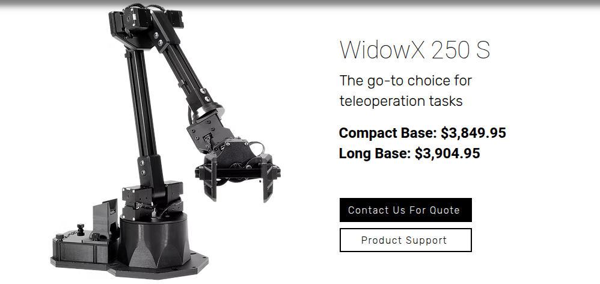
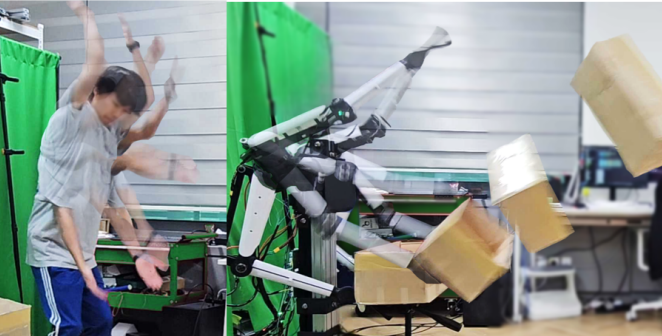
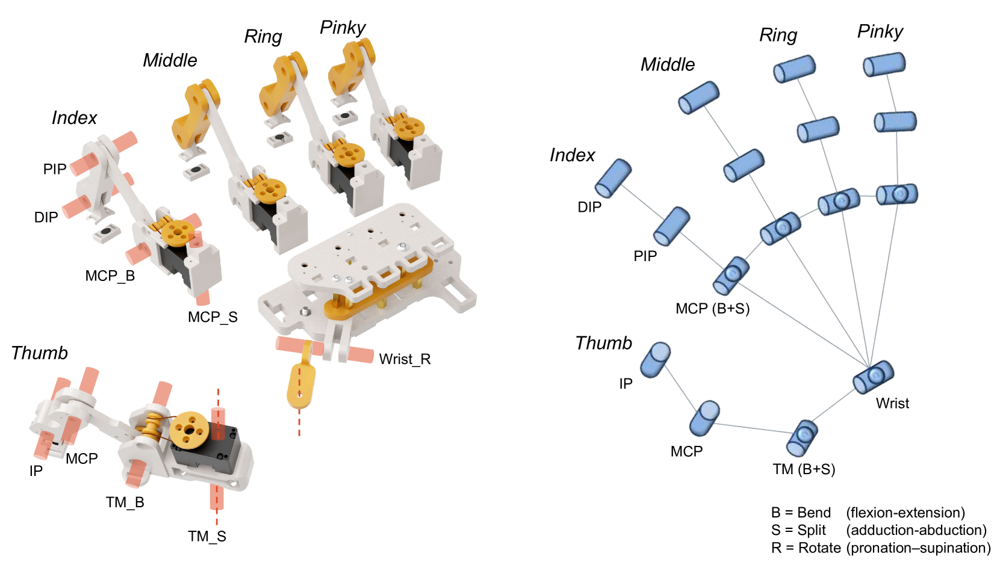

# Robotics-Platforms-Papers

A collection of robotics platforms across industry and academia.

## Industry Platforms

| Company | Comments |
|-------|-------|
| [Dyna Robotics](https://www.dyna.co/) |  Mobile Base with two standard arms (at least $20k imo). Link to above [here](https://www.linkedin.com/posts/dyna-robotics_cleanshow2025-robotics-automation-activity-7366903965462003713-40xB?utm_source=share&utm_medium=member_desktop&rcm=ACoAABSV-R4BLe26RUcv3ZDc9EKe58cRlXKz8O8) |
| [Piper](https://global.agilex.ai/products/piper) arm for $2.5k by [AgileX Robotics](https://global.agilex.ai/pages/about-us) | . $6.5k cost |  |
| [Allegro Hand](https://www.allegrohand.com/?gad_source=1&gad_campaignid=21343116219&gbraid=0AAAAA9UNdCx_a9ovFh8C1jpO0fg2CgIxe&gclid=CjwKCAjwtrXFBhBiEiwAEKen1yZzFNLVnxucm3Pu7FraqHEa33LmQwF7H-VHnctP5Q5-Asm_xQv0IBoChKgQAvD_BwE). Cost supposedly over $16k according to LEAP Hand paper |  |
| [Ufactory Arm](https://www.ufactory.us/?utm_source=google&utm_medium=cpc&utm_campaign=competitorsaisa&utm_term=ur&gad_source=1&gad_campaignid=22247466162&gbraid=0AAAAApkOHBCXVyg-3N4z2NMVbNN4x8Hpy&gclid=CjwKCAjwk7DFBhBAEiwAeYbJsX-UCjeetiMaLv2gJDxo9XbBT2ssLuWmWGtq4MRxVJvQ-wp1wRRgyxoCbOsQAvD_BwE) |  |
| [Standard Bots](https://standardbots.com/?utm_term=cobots&utm_campaign=Search-HighValue&utm_source=adwords&utm_medium=ppc&hsa_acc=7267437431&hsa_cam=22846672441&hsa_grp=183461319255&hsa_ad=680186556473&hsa_src=g&hsa_tgt=kwd-304891322623&hsa_kw=cobots&hsa_mt=b&hsa_net=adwords&hsa_ver=3&gad_source=1&gad_campaignid=22846672441&gbraid=0AAAAABoFo6iSiMPcya4mZ98dAuyINwvLn&gclid=CjwKCAjwk7DFBhBAEiwAeYbJseTpTkBng-Ujyhn-TYrXs36dixGhTThXJSJMFRzToWIJIFNjUEZfXhoCgi8QAvD_BwE) |  |
| [Reachy2](https://fortune.com/2025/04/14/ai-company-hugging-face-buys-humanoid-robot-company-pollen-robotics-reachy-2/) | $70k humanoid with mobile base by Pollen Robotics. Purchased by Huggingface earlier this year.  |
| [RM65-B](https://www.realman-robotics.com/rm65-ae1.html) |  |
| [I2RT](https://i2rt.com/products/yam-manipulator) |  |
| [Elephant Robotics](https://shop.elephantrobotics.com/?utm_term=elephant%20robotics&utm_campaign=%E3%80%90%E4%B8%8D%E8%83%BD%E8%B6%85%E8%BF%87430%E3%80%91Elephantrobotics%E5%93%81%E7%89%8C%E5%90%8D&utm_source=adwords&utm_medium=ppc&dm_acc=3657328933&dm_cam=15616166851&dm_grp=131630769775&dm_ad=570368651482&dm_src=g&dm_tgt=kwd-443848233998&dm_kw=elephant%20robotics&dm_mt=b&dm_net=adwords&dm_ver=3&gad_source=1&gbraid=0AAAAACw-MsX4f1-oFC9YTqdkcso9cTihy&gclid=Cj0KCQjwlMfABhCWARIsADGXdy8mvXngKkAZZ0NyIAoEWhgrBYjIz_5fFLeX91ds-k-yrcSb-PQiNr0aAjBSEALw_wcB): Arms for as cheap as $800. Mobile platforms + arms for as cheap as $1600. |  |
| [Feather Robotics](https://feather.dev/): ca. ~$30k |  |
| [The Amazing Hand](https://github.com/pollen-robotics/AmazingHand) | Huggingface hand for less than $250.  |
| [Huggingface HopeJR Arm](https://huggingface.co/docs/lerobot/hope_jr) |  |
| [K-Scale Labs](https://www.kscale.dev/) - price starts at ~$9k |  |
| [WidowX](https://www.trossenrobotics.com/widowx-250): Trossen arms  ca. $4-5k depending on version |  |
| [Willow Garage PR2](https://www.youtube.com/watch?v=J4m_tEEStiw&ab_channel=SquigglemomandFriends) |  |

## Academia

| Paper | Comments |
|-------|-------|
| [Touch in the Wild Learning Fine-Grained Manipulation with a Portable Visuo-Tactile Gripper](https://arxiv.org/html/2507.15062v1) | Seems like extension of [[Universal Manipulation Interface In-The-Wild Robot Teaching Without In-The-Wild Robots]].  |
| [DexWrist A Robotic Wrist for Constrained and Dynamic Manipulation](https://arxiv.org/html/2507.01008v1) | MIT paper that developed a compliant robotic wrist for advanced manipulation  |
| [Demonstrating Berkeley Humanoid Lite An Open-source, Accessible, and Customizable 3D-printed Humanoid Robot](https://arxiv.org/html/2504.17249v1) | Berkeley Humanoid  |
| [RUKA Rethinking the Design of Humanoid Hands with Learning](https://ruka-hand.github.io/) | Has good overview of existing hands and introduces open-source RUKA hand (ca. $1.3k)  |
| [A low-cost and lightweight 6 DoF bimanual armfor dynamic and contact-rich manipulation](https://arxiv.org/pdf/2502.16908) | $6k bimanual manipulator that is stationary  |
| Categorizing robots by performance fitness into the tree of robots - Nature Machine Intelligence | Categorizes robot arms  |
| [DOGlove Dexterous Manipulation with a Low-Cost Open-Source Haptic Force Feedback Glove](https://arxiv.org/html/2502.07730v1) | Tactile glove that assists haptic force feedback during teleoperation  |
| [ToddlerBot Open-Source ML-Compatible Humanoid Platform for Loco-Manipulation](https://toddlerbot.github.io/) | Stanford Humanoid  |
| TidyBot++ An Open-Source Holonomic Mobile Manipulator for Robot Learning |  |
| [𝜋₀ - A Vision-Language-Action Flow Model for General Robot Control](https://arxiv.org/html/2410.24164v3) | Uses [[FAST Efficient Action Tokenization for Vision-Language-Action Models]].  🔎 |
| [DROID - A Large-Scale In-The-Wild Robot Manipulation Dataset](https://arxiv.org/html/2403.12945v2) | Large dataset collected by 50+ authors, Berkeley, Stanford, UT Austin.  |
| [Universal Manipulation Interface In-The-Wild Robot Teaching Without In-The-Wild Robots](https://arxiv.org/html/2402.10329v3) |  |
| [Mobile ALOHA - Learning Bimanual Mobile Manipulation with Low-Cost Whole-Body Teleoperation](https://arxiv.org/html/2401.02117v1) |  |
| [LEAP Hand Dexterous, Low-cost Hybrid Rigid-Soft Hand for Robot Learning](https://v2-adv.leaphand.com/#) | Leap hand 2.0 was introduced at RSS. Links for hand not working well though. Supposedly there is a cheap hand version for $200-$300. V2 looks like  |

Any pull requests with missing platforms or papers are welcome! Connect with me on [X](@alexkoven) or [LinkedIn](@Alexander Nettekoven).

